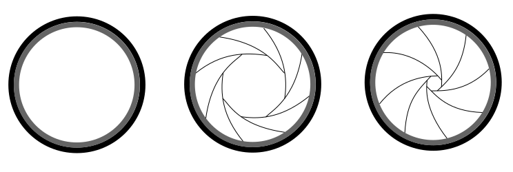

# Glossário básico de fotografia

Por **Paulo Morais**  
<paulo@viraminas.org.br>

## Introdução
Esta é uma tentativa de sistematizar uma série de conceitos aplicados à fotografia, visando facilitar a vida de professores, técnicos e alunos. A lista foi criada no meu tempo livre, a partir dos conceitos que procurei transmitir nos cursos de fotografia com alunos iniciantes, e aos poucos foi sendo aprimorada a partir de diversas pesquisas. Não se trata de um texto definitivo ou completo sobre o tema, muito mais complexo e abrangente do que exposto aqui. Também não é uma lista fechada, sendo revisitada ao longo do tempo. É mais uma lista de apoio para futuras experiências didáticas que está sendo compartilhada para poder ser a para professores, técnicos e estudantes.

<!-- MDTOC maxdepth:3 firsth1:0 numbering:0 flatten:0 bullets:0 updateOnSave:1 -->

[Introdução](#introdução)   
[Mecânica / equipamentos](#mecânica-equipamentos)   
&emsp;&emsp;[ISO](#iso)   
&emsp;&emsp;[Diafragma](#diafragma)   
&emsp;&emsp;[Obturador](#obturador)   
&emsp;&emsp;[Disparador](#disparador)   
&emsp;&emsp;[Fotômetro](#fotômetro)   
&emsp;&emsp;[Câmera](#câmera)   
&emsp;&emsp;[Compensação de exposição](#compensação-de-exposição)   
&emsp;&emsp;[Pin-hole](#pin-hole)   
&emsp;&emsp;[Objetiva](#objetiva)   
&emsp;&emsp;[Macro](#macro)   
&emsp;&emsp;[Distância focal](#distância-focal)   
[Estética](#estética)   
&emsp;&emsp;[Profundidade de campo](#profundidade-de-campo)   
&emsp;&emsp;[Silhueta](#silhueta)   
&emsp;&emsp;[Regra dos terços](#regra-dos-terços)   
&emsp;&emsp;[Foco](#foco)   
&emsp;&emsp;[Ponto de fuga](#ponto-de-fuga)   
&emsp;&emsp;[Plongée](#plongée)   
&emsp;&emsp;[Contra-plongée](#contra-plongée)   
&emsp;&emsp;[Enquadramento dentro do enquadramento](#enquadramento-dentro-do-enquadramento)   
[Luz](#luz)   
&emsp;&emsp;[Luz natural](#luz-natural)   
&emsp;&emsp;[Luz artificial](#luz-artificial)   
&emsp;&emsp;[Luz ambiente](#luz-ambiente)   
&emsp;&emsp;[Luz dura](#luz-dura)   
&emsp;&emsp;[Luz suave](#luz-suave)   
&emsp;&emsp;[Contraluz](#contraluz)   
&emsp;&emsp;[Difusor](#difusor)   

<!-- /MDTOC -->

<a name="#mecanica" />
## Mecânica / equipamentos

<a name="#iso" />
#### ISO
Indicador de sensibilidade do sensor da câmera (ou do filme). Quanto maior o número, mais luz será captada. O indicador geralmente se inicia no 100 e pode chegar a 6400, 12800 ou ainda mais, dependendo da capacidade da câmera. ISO muito alto gera ruído na imagem captada.

<a name="#diafragma" />
#### Diafragma
Mecanismo presente na lente da câmera que, ao critério do fotógrafo, pode ser mais fechado ou aberto, desde que a câmera tenha ajustes manuais. Diferentemente do obturador, o diafragma não se altera quando o disparador da câmera é acionado -- ou seja: definida sua abertura pelo fotográfo, ele não se move com o clique da câmera. Quando muito aberto, o diafragma reduz a **profundidade de campo**, quando muito fechado, a aumenta.

#### Obturador
Mecanismo presente no corpo das câmeras que, grosso modo, se abre e fecha quando o disparador é acionado. A velocidade com a qual se move pode ser definida pelo fotógrafo nas câmeras com ajuste manual. Quando acionado em velocidade mais lenta, permite que a imagem crie um **borrão de movimento**. Inversamente, quando acionado em velocidade mais rápida, cria a sensação de **congelar o movimento**.

<a name="#disparador" />
#### Disparador
Botão que, quando acionado, induz à abertura do obturador para a escrita da luz no sensor. É o botão que faz o clique na câmera. Existem disparadores externos, que, quando plugados na câmera, permitem que o fotógrafo acione o obturador à distância, sem correr o risco de tremer a imagem, ou mantenha o obturador aberto por tempos maiores.

<a name="#fotômetro" />
#### Fotômetro
Mecanismo, geralmente embutido nas câmeras (em alguns casos, é outro equipamento independente), que auxilia o fotógrafo na medição da luz. Com base no fotômetro, o fotógrafo define as configurações de diafragma, ISO e obturador a fim de se obter a escrita da luz.

<a name="#camera" />
#### Câmera
Equipamento básico da fotografia, é uma caixa escura totalmente vedada onde fica um filme fotográfico ou um sensor digital sensível à luz. A entrada de luz acontece apenas por opção do fotógrafo, a partir da abertura do obturador.

<a name="#compensação-de-exposição" />
#### Compensação de exposição
Mecanismo, geralmente presente em câmeras com fotometria automática, que permite ao fotógrafo manipular o equipamento para que entre menos ou mais luz no sensor. A partir do momento em que o equipamento escolhe as configurações de obturador, diafragma e ISO, a compensação de exposição altera esses elementos para corrigir possíveis distorções da interpretação automática da luz.

#### Pin-hole
Do inglês, "buraco da agulha". Tipo de câmera rudimentar, feita com uma caixa, lata ou algo similar, completamente vedada, em que um pequeno furo é fechado por uma fita adesiva, que faz as vezes de obturador. Dentro da câmera, vai um papel fotográfico, sensibilizado ao gosto do operador, conforme o tempo de abertura do buraco.

<a name="#objetiva" />
#### Objetiva
Conjunto de lentes óticas que direciona a luz até o sensor da câmera, provocando o enquadramento, o foco e outras condições ao gosto do fotógrafo. É considerada objetiva o conjunto de lentes que reflete exatamente a visão humana -- geralmente aquelas com distância focal de 50mm.

<a name="#macro" />
#### Macro
Denominação dada à capacidade da lente de focar objetos muito próximos da câmera.

<a name="#distância-focal" />
#### Distância focal
Medida da distância entre o ponto onde se forma o foco e o sensor da câmera. Quanto maior a distância focal, maior a capacidade da foto de se aproximar de um objeto que está longe. Quanto menor, maior a abrangência de objetos ao redor da câmera exibida na fotografia.

## Estética

<a name="#profundidade-de-campo" />
#### Profundidade de campo
Pode-se dizer que é o nível de precisão do [foco](foco) em que se encontra o objeto ou assunto fotografado. Quanto maior a profundidade de campo, mais objetos estarão no foco em sua fotografia. De forma inversa, quanto menor a profundidade de campo, menos elementos estarão em foco.

<a name="#silhueta" />
#### Silhueta
Tipo de fotografia em que o objeto ou assunto está subexposto e há [contraluz](#contraluz). É muito comum em fotografias ao por-do-sol.

<a name="#regra-dos-terços" />
#### Regra dos terços
Trata-se de uma convenção de enquadramento, segundo a qual objetos geram fotografias mais bonitas se deslocados para um dos terços do quadro, evitando, portanto, a centralização. Em outras palavras, o fotógrafo deve dividir o quadro em três partes (câmeras digitais fornecem esta opção) e posicionar os objetos verticalmente ou horizontalmente no primeiro ou terceiro quadro.

<a name="#foco" />
#### Foco
Na física, é onde convergem os raios luminosos. Lentes óticas alteram direção da luz e promovem a convergência dos raios em um determinado ponto. Quando os raios rebatidos em um determinado objeto convergem precisamente no sensor, este fica no foco da imagem.

<a name="#ponto-de-fuga" />
#### Ponto de fuga
Ponto de uma imagem para o qual convergem em perspectiva as linhas da paisagem, por exemplo, linhas dos andares do prédio ou dos degraus de uma escada. Quando o ponto de fuga é posicionado exatamente centro da fotografia, o fotógrafo cria uma imagem simétrica.

<a name="#plongée" />
#### Plongée  
Do francês, "mergulho". Tipo de posicionamento da câmera em que o objeto ou assunto a ser fotografado encontra-se abaixo do fotógrafo, provocando uma angulação em que a câmera "olha para baixo". Quando uma pessoa é fotografada neste enquadramento, geralmente provoca-se a sensação de inferioridade ou opressão. Conceito mais usado no cinema.

<a name="#plongee" />
#### Contra-plongée
O oposto do [plongée](#plongée). Causa a sensação de superioridade quando uma pessoa é fotografada com esta angulação.

<a name="#enquadramento-dentro-do-enquadramento" />
#### Enquadramento dentro do enquadramento
Aparece quando, numa fotografia, há um objeto em especial enquadrado em outra moldura que não a da própria fotografia, como uma janela, uma grade ou um corrimão.

<a name="#luz" />
## Luz

<a name="#luz-natural" />
#### Luz natural
É a luz que encontramos na natureza. A principal é a luz do sol, mas outros exemplos de luzes naturais são as estrelas ou a luz rebatida pela lua.

<a name="#luz-artificial" />
#### Luz artificial
É a luz gerada intencionalmente pelo fotógrafo para intervir sobre o assunto ou objeto que quer fotografar. É o que se usa, por exemplo, em estúdios fechados de fotografia.

<a name="#luz-ambiente" />
#### Luz ambiente
É a luz usada pelo fotográfo, sem alteração, quando registra um assunto ou objeto. Pode ser composta tanto por luzes elétricas quanto luz natural. Numa casa, por exemplo, tanto a luz do sol que entra por uma janela quanto a gerada por uma televisão são luzes ambientes, desde que estejam postas independentemente da intenção do fotógrafo, que apenas a registra.

<a name="#luz-dura" />
#### Luz dura
É o tipo de luz em que as áreas de sombra e luminosidade são bem delimitadas. É gerada por fontes de luz distantes e/ou pequenas em relação ao objeto.

<a name="#luz-suave" />
#### Luz suave
Tipo de luz em que as sombras e áreas de luminosidade não são bem definidas, gerando imagens mais harmônicas ou confortáveis ao olho humano. É gerada por fontes de luz grandes e próximas em relação ao objeto. Uma luz suave também pode ser obtida por meio de um **difusor** ou pelo rebatimento de uma fonte de luz.

<a name="#contraluz" />
#### Contraluz
Posicionamento da fonte de luz atrás do objeto ou assunto a ser fotografado, de forma que a luz incida diretamente sobre a lente da câmera.

<a name="#difusor" />
#### Difusor
Anteparo translúcido posicionado entre uma fonte de luz e um objeto ou assunto a ser fotografado, de forma a suavizar a luz incidente. Um exemplo clássico de difusores naturais são as nuvens, que suavizam a luz do sol e tornam os dias nublados especiais para ensaios ao ar livre.
